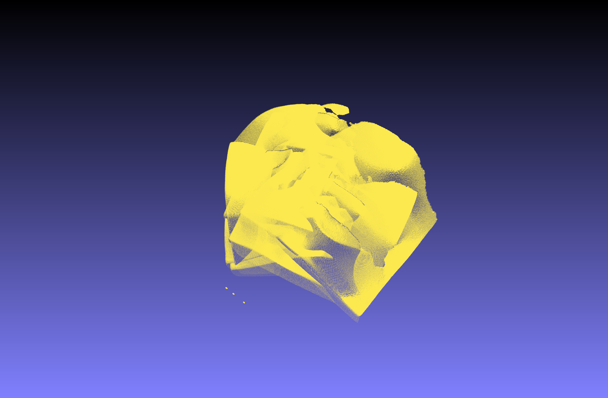
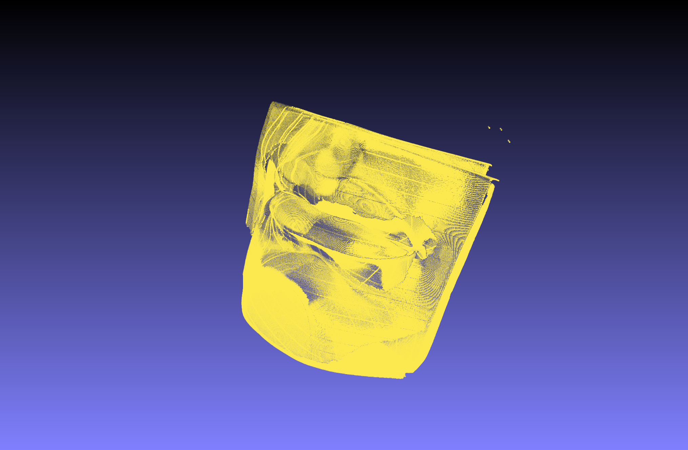
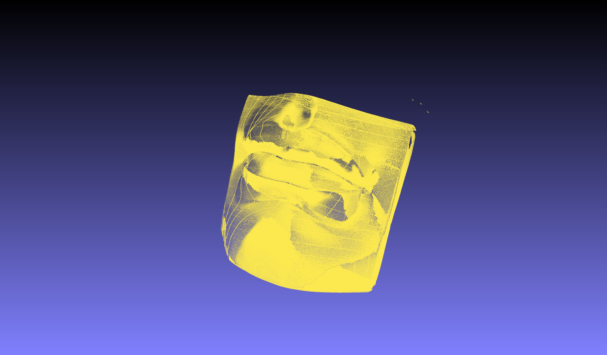

# 计算机视觉 III 三维视觉 实验报告

| 姓名   | 学号       |
| ------ | ---------- |
| 杨思祺 | 2201111753 |

## 实验过程

首先，使用 MeshLab 软件预览扫描得到的点云（对应 `data/raw` 目录下的六个 `.asc` 文件），如下图所示，六次扫描得到的点云以不同的角度叠放在一起。

接下来，使用 Geomagic Warp 软件进行初步配准，得到的新点云（对应 `data/cal` 目录下的六个 `.asc` 文件）在 MeshLab 中可视化结果如下图所示。

已经可以大致看出石膏模型的轮廓，但是在模型边缘等处仍然存在非常明显的偏差。

我使用 Python 实现了 Iterative Closest Point 算法（对应 `icp.py` 文件），然后通过将 `data/cal` 目录下的前五个点云分别对齐到第六个点云上，实现六个点云的配准（具体步骤见 `scripts/run_icp.sh`，输出结果为 `data/out` 下的六个 `.asc` 文件）。经过 ICP 算法对齐之后的点云如下图所示。

可以看出配准之后的结果更加准确。

## 实现细节

- `icp.py` 通过使用 `cuml` 库和 `cupy` 库，实现在 NVIDIA GPU 上的高效代数运算和 K 近邻查询。
- 在实验中，通过尝试不同的 `percentile` 参数，我发现将其置为 0.5 可以在大部分数据上取得很好的效果。
- 详细的运行环境说明请参见 `README.md`。
